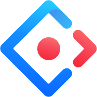
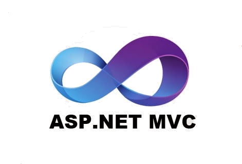

<h1 align="center">Hi 👋, I'm Khaiwhan</h1>
<h3 align="center">🎖️ I'm full-stack developer ⌨️ from Thailand</h3>

## About me 👇

- 🎈 I was born in 1994

- 🖥️ I have been working as a programmer since 2019.

- 🌟 My dream is to create products for people to use.

- 🤖 I’m currently learning **AI**

- 💬 Ask me about **Frontend, Backend, Database**

- 📫 How to reach me **sritonchai.p@gmail.com**

## Skills
### Programming
   
  
  
  
  
  
  
  
### Frontend
  
  
  
  
  
  
  
  
### CSS Framework
  
  
  
 
 
 
 
  
  
### Static Site Generators
  
  
  
### Mobile
  
  
  
  
  
### Backend
  
  
  
  
  
  
  
  
### Database
  
  
  
  
  
  
  
### AI/ML
  
  
  
  
### Data Visualization
  
  
### Devops
  
  
### Testing
  
### Design
  
 
### Tools
  
  
  
  
### Other
  
  
  

## Github stats 📊

  
GitHub Profile Stats 💻

   
    
    
   

  
Profile Views 👁️

   
 

## GitHub Profile Trophy 🏆

